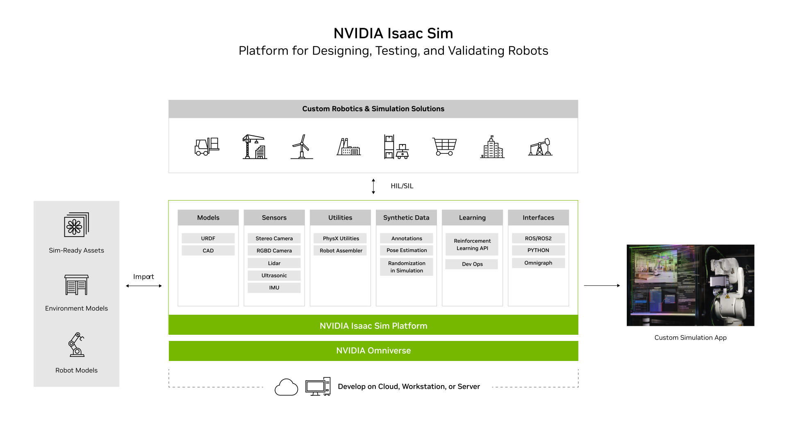
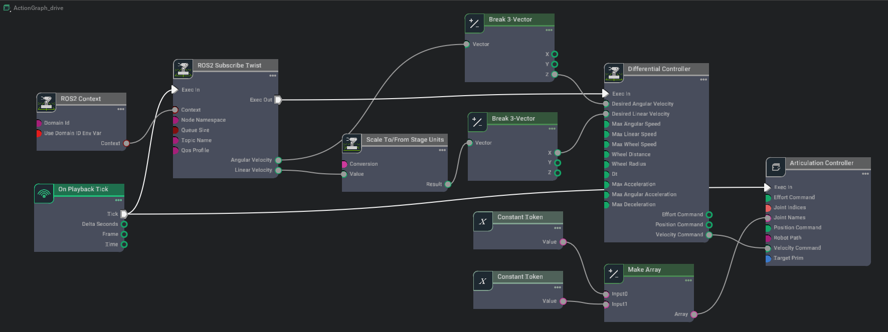
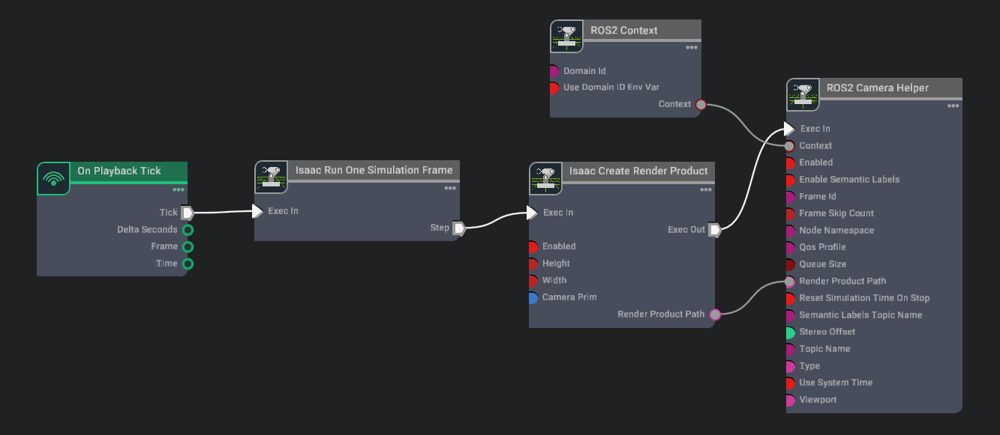
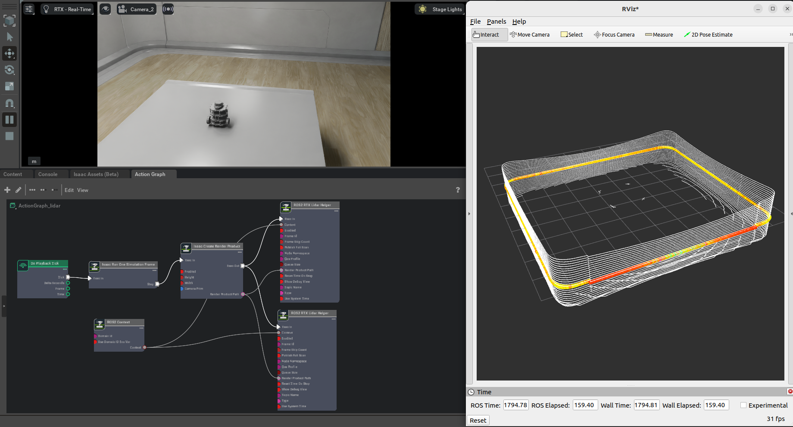
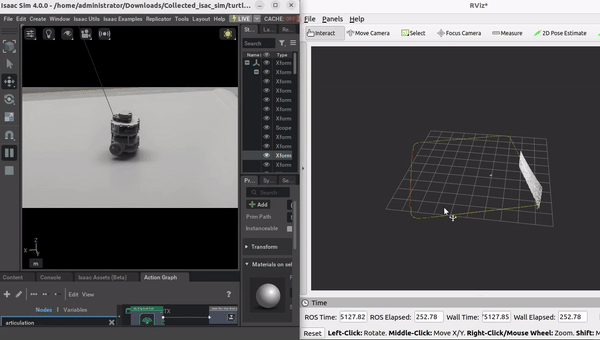
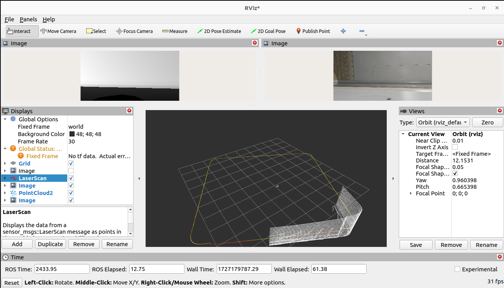
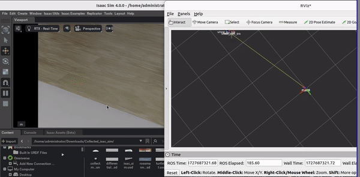
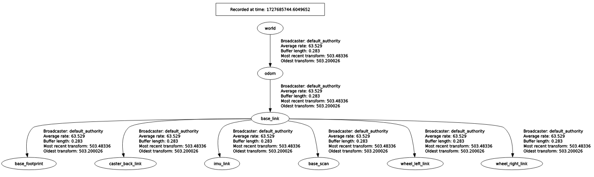
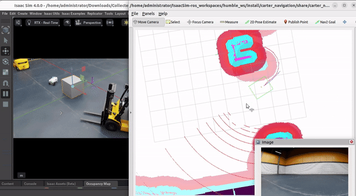

Prior to following these tutorials please ensure ros2 humble workspace is cloned, build and source properly. [Link](https://docs.omniverse.nvidia.com/isaacsim/latest/installation/install_ros.html#isaac-ros-workspace)


# Why did we choose isaac sim 


I have cloned isaac sim ros2 packages in this workspace ```IsaacSim-ros_workspaces/humble_ws``` [how to setup workspace isaac sim ros2](https://docs.omniverse.nvidia.com/isaacsim/latest/installation/install_ros.html#isaac-sim-app-install-ros:~:text=for%20you%20workflow.-,Setting%20Up%20Workspaces,%EF%83%81,-Note)


# Assemble a Custom Robot in ISAAC Sim
Connect rigid bodies using joints, add a joint drive to control the joints, turn a chain of joints into an articulation, and control the robot using an Articulation Velocity Controller. [Step by step guide](https://docs.omniverse.nvidia.com/isaacsim/latest/gui_tutorials/tutorial_gui_simple_robot.html#isaac-sim-app-tutorial-gui-simple-robot:~:text=a%20Simple%20Robot-,Assemble%20a%20Simple%20Robot,%EF%83%81,-Omniverse%20Isaac%20Sim%E2%80%99s)

## Add Camera and Sensors
After assembling a custom robot learn how to attach a camera. Isaac Sim provides a variety of sensors that can be used to sense the environment and robot’s state. 
- [Attach camera](https://docs.omniverse.nvidia.com/isaacsim/latest/gui_tutorials/tutorial_gui_camera_sensors.html#isaac-sim-app-tutorial-gui-camera-sensors:~:text=Camera%20and%20Sensors-,Add%20Camera%20and%20Sensors,%EF%83%81,-Isaac%20Sim%20provides) 
- [Attach lidar](https://docs.omniverse.nvidia.com/isaacsim/latest/advanced_tutorials/tutorial_advanced_range_sensor_lidar.html#isaac-sim-app-tutorial-advanced-range-sensor-lidar:~:text=Using%20Sensors%3A%20LIDAR-,Using%20Sensors%3A%20LIDAR,%EF%83%81,-Learning%20Objectives)

Also understand how convention differs in isaac sim environmet and ros environment [Conventions](https://docs.omniverse.nvidia.com/isaacsim/latest/reference_conventions.html#isaac-sim-cameras:~:text=Isaac%20Sim%20Conventions-,Isaac%20Sim%20Conventions,-%EF%83%81)

## Interactive Scripting
This [tutorial](https://docs.omniverse.nvidia.com/isaacsim/latest/gui_tutorials/tutorial_gui_interactive_scripting.html#:~:text=Interactive%20Scripting-,Interactive%20Scripting,-%EF%83%81) covers:
- Script Editor window and Python editing environment
- Isaac Python REPL extension
- Adding a Cube using USD API
- Adding a Cube using Isaac Sim API

## Omnigraph
OmniGraph is Omniverse’s visual programming framework. In simple words OmniGraph is the visual scripting language of Omniverse. Inside Omniverse Isaac Sim, OmniGraph is the main engine for the Replicators, ROS and ROS2 bridges, sensor access, controllers, external input/output devices, UI, and much more.
There are two graph editors, the Action Graph and the Generic Graph. They can both be found under ‘Window > Visual Scripting’. For majority of cases in Isaac Sim,
we will be using Action graphs

Let’s build an action graph to control a robot in Isaac Sim the Jetbot.

Follow this [tutorial](https://docs.omniverse.nvidia.com/isaacsim/latest/gui_tutorials/tutorial_gui_omnigraph.html#isaac-sim-app-tutorial-gui-omnigraph:~:text=22%20/%2000%3A32-,Try%20It%20Out,-%EF%83%81) to import NVIDIA robot 'jetbot' in the scene and create action graph for the differential drive robot 


# Create a bridge between ROS2 and ISAAC sim
## Driving TurtleBot via ROS2 messages
First clone turtlebot3 repository in your workspace 
```
git clone -b humble-devel https://github.com/ROBOTIS-GIT/turtlebot3.git
```

Built this package only for the tutorial 
```
cd humble_ws && colcon built --packages-select  turtlebot3_description
```
Dont forget to source it
```
source install/setup.bash
```
Go back to isaac sim and import simple_room environment  and turtlebot3 in a new stage.
Note. Only open isaac sim after building humble_ws otherwise the topic wont appear.


Ensure ros2_bridge extension is enabled. It can be enabled from the Extension Manager by searching for ```omni.isaac.ros2_bridge```. Note ROS and ROS2 bridges cannot be enabled simultaneously. To enable one, make sure the other is disabled first.

Play the scene and the topics will be displayed in a terminal. 
check if the topic ```cmd_vel``` is ready to subscribe angular and linear velocities.

```
ros2 topic list
```
Now that a differential base topic is setup, a twist message can be published to /cmd_vel topic to control the robot. Let’s drive it forward with the command:
```
ros2 topic pub /cmd_vel geometry_msgs/Twist "{'linear': {'x': 0.2, 'y': 0.0, 'z': 0.0}, 'angular': {'x': 0.0, 'y': 0.0, 'z': 0.0}}"
```
To stop the robot from moving, publish a zero velocity command:
```
ros2 topic pub /cmd_vel geometry_msgs/Twist "{'linear': {'x': 0.0, 'y': 0.0, 'z': 0.0}, 'angular': {'x': 0.0, 'y': 0.0, 'z': 0.0}}"
```
To make it easier for us to move the Turtlebot around, install the teleop_twist_keyboard by running the following command:
```
sudo apt-get install ros-$ROS_DISTRO-teleop-twist-keyboard
```
Enable driving using the keyboard by running:
```
ros2 run teleop_twist_keyboard teleop_twist_keyboard
```

Follow this [tutorial](https://docs.omniverse.nvidia.com/isaacsim/latest/ros2_tutorials/tutorial_ros2_drive_turtlebot.html#getting-started:~:text=ROS2%20Twist%20message-,Getting%20Started,%EF%83%81,-Important) to understand these ros2 bridge with isac sim concepts

- Drive the robot using the Differential Controller and the Articulation Controller
- Introduction to ROS2 Bridge omnigraph nodes
- Subscribing to a ROS2 Twist message

I applied it on custom robot and i am able to control it using keyboard just like turtlebot.

At this momenet the transforms of the robot relative to the world frame is not being published therefore i am not able to visualize it rviz and rqt_tf_tree. 
The articulation is enabled on base_footprint for turtlebot3 and for custom robot it is enabled on mock_robot prim

## ROS2 Cameras
Understand how to publish camera and perception data in ROS2.
[attach a camera and visualize it in rviz](https://docs.omniverse.nvidia.com/isaacsim/latest/ros2_tutorials/tutorial_ros2_camera.html#:~:text=ROS2%20Cameras-,ROS2%20Cameras,-%EF%83%81)

Please note we can always use ros2 plugins from isaac utils/common_omni_graphs -> ROS2 Camera, for depth image i was not able to visulize depth image because the camera in isac sim was placed too far away. If needed please adjust the camera position so that tht depth is rendered appropriately.

Also understand how to label objects in isaac sim using replicator but this is an optional [replicator](https://docs.omniverse.nvidia.com/isaacsim/latest/replicator_tutorials/tutorial_replicator_getting_started.html#isaac-sim-app-tutorial-replicator-getting-started:~:text=Overview%20and%20Getting%20Started-,Overview%20and%20Getting%20Started,%EF%83%81,-Isaac%20Sim%20Replicator%20is)

To understand how to publish using python scripts please follow this tutorial(must) [publish using python script](https://docs.omniverse.nvidia.com/isaacsim/latest/ros2_tutorials/tutorial_ros2_camera.html#isaac-sim-app-tutorial-ros2-camera:~:text=image%20is%20limited.-,Additional%20Publishing%20Options,%EF%83%81,-To%20publish%20images)


Even though ros clock is not immediately necessary to sync to either simulation time or system time but it is good to understand the concept of simulation time and ros time. [ROS clock](https://docs.omniverse.nvidia.com/isaacsim/latest/ros2_tutorials/tutorial_ros2_clock.html#isaac-sim-app-tutorial-ros2-clock:~:text=ROS2%20Clock-,ROS2%20Clock,-%EF%83%81)


## Lidar with ROS2
Learn how to interface lidar with ros2. [tutorial](https://docs.omniverse.nvidia.com/isaacsim/latest/ros2_tutorials/tutorial_ros2_rtx_lidar.html#:~:text=RTX%20Lidar%20Sensors-,RTX%20Lidar%20Sensors,-%EF%83%81)
Before doing this tutorial watch how to attach lidar on a custom or prebuilt robot [lidar_attach_with_custom_robot](https://docs.omniverse.nvidia.com/isaacsim/latest/advanced_tutorials/tutorial_advanced_range_sensor_lidar.html#isaac-sim-app-tutorial-advanced-range-sensor-lidar:~:text=Using%20Sensors%3A%20LIDAR-,Using%20Sensors%3A%20LIDAR,-%EF%83%81)



Watch how it is visulaized in rviz2 along side isaac sim 



This tutorial covered creating and using the RTX Lidar Sensor with ROS2:

- Adding a RTX Lidar sensor

- Adding a RTX Lidar and PointCloud ROS2 nodes.

- Displaying multiple sensors in RViz2.

Meaning of omni verse nodes used to publish lidar pointcloud and laser scan:
- On playback tick: triggers all the nodes once played
- Isaac Run One Simulation Frame: This is the node to running the create render product pipeline once at the start to improve performance.
- ROS2 Context: This node creates a ros2 context for a given domain id.
- Isaac Create Render Product: Create a render product. target prim select the RTX Lidar.
- ROS2 RTX Lidar Helper: This node will handle publishing of the laser scan message from the rtx lidar
- If you wish to also publish point cloud data, add another ROS2 RTX Lidar Helper node, and under input type select point_cloud and change the topic name to point_cloud. 


When i set the frameid to ```world```  i could see the laser scan as well as camera topic however when i set the frameid to ```sim_lidar``` i could only see camera topic in rviz. You can either make your own action graph for lidar by following the [guide](##lidar-with-ros2)


Now learn how to add global and relative transforms to a TF tree in next section.
[ROS2 Transform Trees and Odometry](https://docs.omniverse.nvidia.com/isaacsim/latest/ros2_tutorials/tutorial_ros2_tf.html#isaac-sim-app-tutorial-ros2-tf:~:text=Trees%20and%20Odometry-,ROS2%20Transform%20Trees%20and%20Odometry,%EF%83%81,-Learning%20Objectives)


## Display multiple sensors in rviz2
All the messages should be synced up and timestamped correctly if using multiple sensors.

To visualize all the sensors as well as the tf tree all at once inside RViz, the frameId and topicNames must follow a certain convention [for reference](https://docs.omniverse.nvidia.com/isaacsim/latest/ros2_tutorials/tutorial_ros2_rtx_lidar.html#multiple-sensors-in-rviz2)

I set the frame id to world after change frame_id of lidar to world now i can visualize camera, laser scan and point cloud at the same time in rviz2


## ROS2 Transform Trees and Odometry
The issue realated to frameid could be resolved if following topics are cover in this tutorial.


lets track the camera’s position in the global frame.
Add two cameras i.e ```camera_1```  and ```camera_2``` to a TF tree and add an action graph to both the prims of cameras and publish their TF's and visulaize their orientation in rviz. notice both cameras parent link is set to ```world`` as a fixed frame. 

The issue is these relative transform are static and are not moving as the robot is moving in isaac sim because the robot's odometery is not setup. we need to publish the odometry ROS message as well as its corresponding transforms.

For detailed tutorial please follow the link [tutorial](https://docs.omniverse.nvidia.com/isaacsim/latest/ros2_tutorials/tutorial_ros2_tf.html#isaac-sim-app-tutorial-ros2-tf:~:text=Trees%20and%20Odometry-,ROS2%20Transform%20Trees%20and%20Odometry,-%EF%83%81)


To visualize rqt graph and their parent child relation please use the following command 
```
 ros2 run rqt_tf_tree rqt_tf_tree  --force-discover
```

I set to the articualtion root on turtlebot3_burger prim instead of base_link, this allowed me to visualize all the child frame of base_link



## [ROS2 Setting Publish Rates](https://docs.omniverse.nvidia.com/isaacsim/latest/ros2_tutorials/tutorial_ros2_publish_rate.html#isaac-sim-app-tutorial-ros2-publish-rate:~:text=Setting%20Publish%20Rates-,ROS2%20Setting%20Publish%20Rates,-%EF%83%81)
Learn about 
- Set the simulation frame rate in Isaac Sim.
- Set different publish rates for various ROS2 publishers simultaneously.

After setting, check ros2 publishing rate ```ros2 topic hz /topic_name```

## [ROS 2 Quality of Service (QoS)](https://docs.omniverse.nvidia.com/isaacsim/latest/ros2_tutorials/tutorial_ros2_qos.html#isaac-sim-app-tutorial-ros2-qos:~:text=of%20Service%20(QoS)-,ROS%202%20Quality%20of%20Service%20(QoS),%EF%83%81,-Learning%20Objectives)

Learn about 
- QoS Profile Node.
- Setting Quality of Service (QoS) for all ROS2 OmniGraph nodes.
- Setting a static ROS2 publisher using a custom QoS Profile.

In ROS2-sourced terminal, run the following command to retrieve the QoS settings for the topic. 
```ros2 topic info /topic -v```

## [ROS2 Navigation](https://docs.omniverse.nvidia.com/isaacsim/latest/ros2_tutorials/tutorial_ros2_navigation.html#isaac-sim-app-tutorial-ros2-navigation:~:text=ROS2%20Navigation-,ROS2%20Navigation,%EF%83%81,-Note)

### NAV2 installation guide
Install the Nav2 packages 
```
sudo apt install ros-humble-navigation2
sudo apt install ros-humble-nav2-bringup
```
Ensure navigation2 and nav2-bringup is installed 
```
apt list --installed | grep ros-humble-navigation2
```
```
apt list --installed | grep ros-humble-nav2-bringup
```

Install Turtlebot 3 packages
```
sudo apt install ros-humble-turtlebot3-gazebo
```
Ensure turtlebot3 pacakge is installed 
```
apt list --installed | grep ros-humble-turtlebot3-gazebo
```
Source a terminal and export robot model 
```
export TURTLEBOT3_MODEL=waffle
export GAZEBO_MODEL_PATH=$GAZEBO_MODEL_PATH:/opt/ros/<ros2-distro>/share/turtlebot3_gazebo/models
```

In the same terminal run to open rviz and gazebo  
```
ros2 launch nav2_bringup tb3_simulation_launch.py headless:=False
```
This launch file will launch Nav2 with the AMCL localizer in the ```turtlebot3_world``` world. It will also launch the robot state publisher to provide transforms, a Gazebo instance with the Turtlebot3 URDF, and RVIZ.

If you dont see the robot in gazebo you can insert the robot model in insert>Add Path>Turtlebot3(Waffle)


After starting, the robot initially has no idea where it is. Give the starting position by clicking the “2D Pose Estimate” button in RViz, After setting the initial pose, the transform tree will be complete and Nav2 will be fully active and ready to go.

Now give a goal position using ```Nav2Goal``` in rviz

After having the packages installed and pre-requisites done generate [Occupancy Map](https://docs.omniverse.nvidia.com/isaacsim/latest/ros2_tutorials/tutorial_ros2_navigation.html#isaac-sim-app-tutorial-ros2-navigation:~:text=external%20pointcloud_to_laserscan%20node) by following the instruction carefuly and save file occupancy map paramters file called ```carter_warehouse_navigation.yaml``` and map file called ```carter_warehouse_navigation.png``` in map folder of cater_navigation package.

An occupancy map is now ready to be used with Nav2!

[Running Nav2](https://docs.omniverse.nvidia.com/isaacsim/latest/ros2_tutorials/tutorial_ros2_navigation.html#isaac-sim-app-tutorial-ros2-navigation:~:text=used%20with%20Nav2!-,Running%20Nav2,-%EF%83%81) Nav2 with Nova Carter in Small Warehouse.
Go to the cloned repository, source it and launch this file after playing the simulation
```
ros2 launch carter_navigation carter_navigation.launch.py
```

I was not able to see the map after launching the carter_navigation launch file becuase i did not save the occupancy map with the generated occupancy map name in isaac.  
You should be able to give the goal position to carter through rviz 


> [!WARNING]  
> save the occupancy map with the generated occupancy map name in isaac.

> [!Issues encountered]
> Tried to add people animation in navigation scene but the character did not move. Alternatively i directly gave GoTo command from the people_simulation.
> The Lidar of Cartar Nova robot has liimited min rage set in simulation therefore it collides with humans 
> In real Carter Nova has HESAI XT 32 lidar that has 0.05m range. Look into urdf setting to adjust the min and max rage 

## [Simulating people in the scene](https://docs.omniverse.nvidia.com/isaacsim/latest/features/warehouse_logistics/ext_omni_anim_people.html#:~:text=Omni.Anim.People-,Omni.Anim.People,%EF%83%81,-Warning)

A simulation consists of a sequence of actions for each character in the scene to perform. There are five supported character actions:

- Idle
- Look around
- Queue
- Sit/Stand
- Walk

[Setup Simulation from scratch](https://docs.omniverse.nvidia.com/isaacsim/latest/features/warehouse_logistics/ext_omni_anim_people.html#:~:text=animation%20graph%20nodes.-,Setup%20Simulation%20From%20Scratch,-%EF%83%81):
- Add NavMesh Volume Create->Navigation->NavMeshVolume
- Adjust Navmesh settings
- Bake NavMesh
- Disable Show By Type > Navmesh


[Manually Setup Characters](https://docs.omniverse.nvidia.com/isaacsim/latest/features/warehouse_logistics/ext_omni_anim_people.html#:~:text=creating%20a%20simulation.-,Manually%20Setup%20Characters,-%EF%83%81) 
- Create Xform under /World and rename it to Characters
- Drag the character and the biped setup to the characters
- enable omni.anim.people extension from window > extensions
- expand each character while holding cntrl until SkelRoot type > Right click > Add > Animiation > Animation Graph
- Similarly add python script ```character_behavior.py```  SkelRoot type > Right click > Add > Python Scripting
- Open text file and give goto commans example ```SkelRoot_name GoTo 10 10 0 _``` and add the files path to the people_simulation
- Bake it and switch off  NavMesh based simulation from people simulation before playing. Otherwise the character wont move as desired


> [!Note]
> Avoid Moving Objects attach ```dynamic_obstacle.py``` to the cube and observe the character will avoid this slow moving cube

