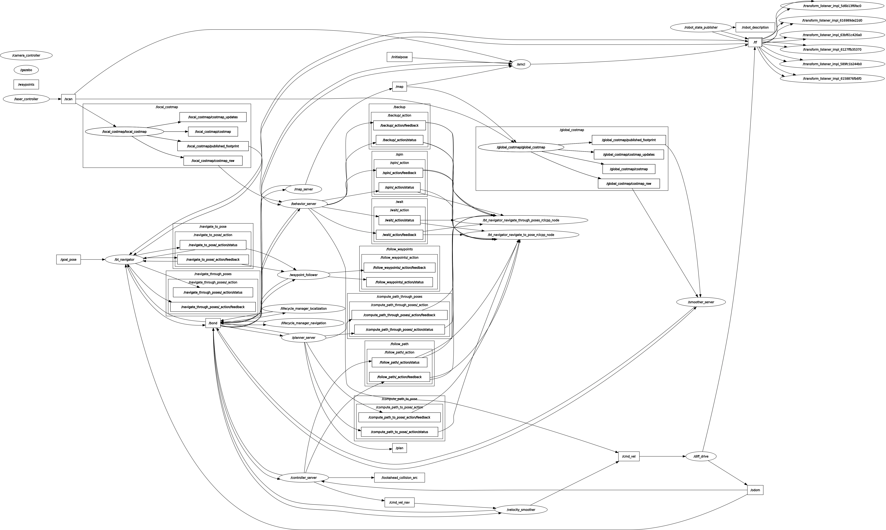

Combination 3: NavFn Planner + Regulated Pure Pursuit Controller
================================================================

This configuration utilizes the **NavFn Planner** for global path planning and the **Regulated Pure Pursuit Controller** for local trajectory adjustments. While this combination is highly efficient for straight-line movements, its performance diminishes when navigating through close proximities or dynamic environments.

Why Regulated Pure Pursuit Controller is a Good Choice
-------------------------------------------------------

The **Regulated Pure Pursuit Controller** is known for its simplicity and reliability in following global paths, particularly in open environments. It is designed to scale its velocity based on proximity to obstacles and path curvature, ensuring smooth and precise motion.

**Key Advantages**:
- **Ideal for Straight-Line Movements**: Ensures smooth and predictable navigation without significant path deviations.
- **Velocity Regulation**: Dynamically adjusts speed to maintain safety when approaching obstacles.
- **Ease of Tuning**: Fewer parameters compared to more complex controllers, simplifying configuration.

Relevant Parameters for Regulated Pure Pursuit Controller
---------------------------------------------------------

.. list-table:: Regulated Pure Pursuit Controller Parameters
   :header-rows: 1
   :widths: 30 20 50

   * - **Parameter**
     - **Value**
     - **Description**
   * - `desired_linear_vel`
     - `0.5`
     - Target velocity for the robot's linear motion.
   * - `lookahead_dist`
     - `0.6`
     - Distance ahead of the robot for trajectory adjustments.
   * - `min_lookahead_dist`
     - `0.3`
     - Minimum distance for trajectory adjustments.
   * - `max_lookahead_dist`
     - `0.9`
     - Maximum distance for trajectory adjustments.
   * - `rotate_to_heading_angular_vel`
     - `1.8`
     - Angular velocity for orienting toward the path heading.
   * - `use_velocity_scaled_lookahead_dist`
     - `false`
     - Disables scaling of lookahead distance based on velocity.
   * - `use_collision_detection`
     - `true`
     - Enables obstacle detection for safer navigation.
   * - `max_allowed_time_to_collision_up_to_carrot`
     - `1.0`
     - Maximum allowed time to potential collisions along the path.
   * - `min_approach_linear_velocity`
     - `0.05`
     - Minimum velocity when approaching a goal or obstacle.
   * - `transform_tolerance`
     - `0.1`
     - Tolerance for transform lookups to ensure stability in real-time adjustments.

Testing Scenarios and Observations
----------------------------------

The robot's performance was evaluated under three scenarios using this combination:

1. **Straight-Line Movement**
   - The robot navigated smoothly and efficiently, adhering to the global path without significant deviations.
   - Velocity regulation ensured stable and precise motion.

   .. figure:: media/gifs/comb_3/straight.webp
      :alt: Straight-Line Movement GIF
      :width: 80%
      :align: center

2. **Navigating Static Obstacles**
   - Performance was suboptimal, particularly when passing through close gaps.
   - The robot struggled with efficiency compared to other combinations like NavFn + DWB and NavFn + MPPI.

   .. image:: media/gifs/comb_3/static2.webp
      :alt: Static Obstacles GIF
      :width: 80%
      :align: center

3. **Navigating Dynamic Obstacles**
   - The robot managed to replan and avoid moving obstacles, but the response time was slower than other controllers.
   - While it successfully reached the goal pose, the delay in path adjustments indicated limited efficiency in dynamic scenarios.

   .. image:: media/gifs/comb_3/Dynamic.webp
      :alt: Dynamic Obstacles GIF
      :width: 80%
      :align: center

Performance Summary
-------------------

.. list-table:: Performance Summary
   :header-rows: 1
   :widths: 30 70

   * - **Scenario**
     - **Performance**
   * - **Straight-Line Movement**
     - Smooth and precise navigation, ideal for open spaces.
   * - **Static Obstacles**
     - Struggled with close proximities, less efficient compared to other combinations.
   * - **Dynamic Obstacles**
     - Slow in replanning and path adjustments, though able to reach the goal.

Conclusion
----------

The combination of **NavFn Planner** and **Regulated Pure Pursuit Controller** is well-suited for open environments with minimal obstacles. However, its limitations become evident in more complex scenarios, such as navigating through tight spaces or reacting to dynamic obstacles.

**Future Improvements**:
- Consider using **DWB** or **MPPI** for environments with close proximities or high dynamic activity.
- Fine-tune parameters like `lookahead_dist` and enable **velocity-scaled lookahead** for more responsive adjustments.

Interconnected Nodes in Nav2 Stack
----------------------------------

To better understand the communication between various components of the Nav2 stack, here’s the **RQT Graph** visualization of interconnected nodes. This includes key nodes like the **local cost map**, **global cost map**, **controller server**, **planner server**, and **behavior server**.

.. note::
    The RQT graph illustrates how these components interact to ensure smooth and efficient navigation. Each node plays a critical role:
    - **Planner Server**: Computes the global path.
    - **Controller Server**: Adjusts the local trajectory for real-time obstacle avoidance.
    - **Behavior Server**: Manages higher-level behaviors like spinning, backing up, and driving on heading.
    - **Cost Maps**: Provide the environmental representation for planning and obstacle avoidance.

    This interconnected structure ensures seamless communication and dynamic adaptability during navigation.
