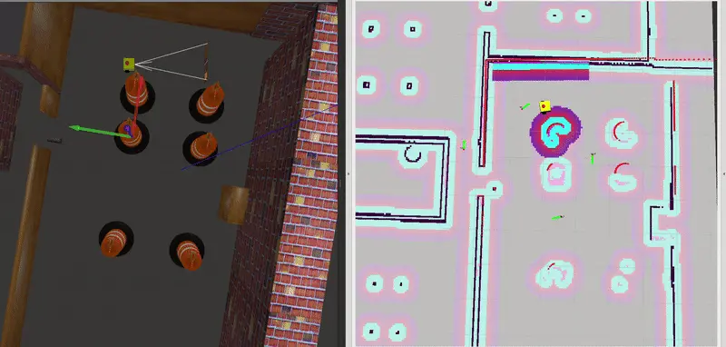
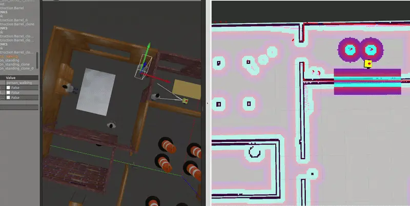

Combination 4: Theta* + Regulated Pure Pursuit Controller
=========================================================

How Theta* Differs from Navfn Planner
-------------------------------------

Theta* generates any-angle paths with smoother, more direct line segments, while Navfn is constrained to grid-based paths, resulting in more angular and less efficient routes.

Theta* + RPP: Observations and Insights
---------------------------------------

Straight-Line Movement
~~~~~~~~~~~~~~~~~~~~~~

In a straightforward scenario, the robot moved along a straight line as expected when the path was unobstructed. This behavior highlights the efficiency of the Theta* planner in generating direct, any-angle paths, reducing unnecessary turns, and optimizing the travel distance.

.. image:: media/gifs/comb_4/straight.webp
   :alt: Straight Line Movement
   :width: 80%
   :align: center

Static Environment
~~~~~~~~~~~~~~~~~~

When multiple waypoints were provided, the robot recalculated the path dynamically instead of strictly following the given waypoints. It took a shortcut, reaching the goal faster than if it had adhered to the exact waypoints.

.. note::  
    The Theta* planner is designed to optimize for the shortest and most efficient path between the start and goal. Waypoints, unless enforced as strict constraints, are treated as optional guides. The recalculated shortcut reflects the planner’s inherent focus on path optimization and reduced traversal time.

Dynamic Environment
~~~~~~~~~~~~~~~~~~~

In a dynamic setup, a walking person primitive was introduced as a moving obstacle:

- **First Trial:**  
  The robot collided with the moving person, likely due to limitations in the **RPP local planner** as observed earlier with the Navfn planner. The RPP did not react quickly enough to the dynamic change.

- **Second Trial:**  
  After the person moved aside, the robot successfully stopped, recalculated a shorter path, and reached the goal.

.. note:: 
    This outcome underscores the adaptability of Theta* + RPP (Reactive Path Planning). The planner dynamically recalculated the path based on real-time updates, showcasing its ability to handle dynamic obstacles effectively. The successful adjustment in the second trial highlights the importance of robust integration between the global and local planning layers.

Performance Summary
-------------------

.. list-table:: Performance Summary
   :header-rows: 1
   :widths: 30 40 30

   * - **Feature**
     - **Performance**
     - **Comments**
   * - **Straight-Line Movement**
     - Smooth and efficient direct paths.
     - Theta* generates optimal, any-angle paths, making it ideal for open and unconstrained environments.
   * - **Static Obstacles**
     - Dynamically recalculates efficient paths.
     - Bypasses unnecessary waypoints to optimize travel time and distance in static environments.
   * - **Dynamic Obstacles**
     - Relies on the local planner for handling dynamic changes effectively.
     - RPP’s responsiveness impacts success; improvements in local planner integration could enhance reliability.

Conclusion
----------

These observations illustrate the strengths of Theta* + RPP in both static and dynamic scenarios. While the planner excels at optimizing paths, ensuring a robust local planner is critical for managing dynamic obstacles in real-world environments.
