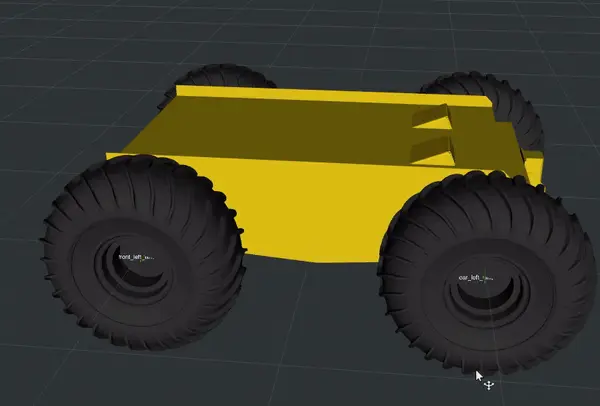

Gazebo Fortress: The Bridge Between Classic and Modern Simulation
=================================================================

Gazebo Fortress, the successor to Gazebo Classic, brings modern features and improved performance while maintaining the familiar usability of its predecessor. It offers enhanced simulation capabilities, making it a strong contender for robotics testing. However, it also introduces some complexities compared to Gazebo Classic, especially for those migrating existing ROS 2 packages.

Key Features of Gazebo Fortress
-------------------------------

- **Improved Graphics and High-Definition Simulation:**  
  Gazebo Fortress enhances the graphical fidelity over Classic, offering more immersive environments. While not as graphically detailed as Isaac Sim, Fortress strikes a balance between realism and performance.

- **Better Support for Dynamic Environments:**  
  Fortress introduces features like improved collision detection and smoother handling of dynamic objects, which are critical for testing algorithms involving moving obstacles.

- **Enhanced Plugin Ecosystem:**  
  A rich plugin ecosystem allows for better integration of sensors and actuators, providing more flexibility for robot developers.

- **Support for ROS 2 Packages:**  
  Migrating ROS 2 packages from Gazebo Classic to Fortress is relatively straightforward, thanks to the `migration guide <https://gazebosim.org/docs/fortress/migrating_gazebo_classic_ros2_packages/>`_. However, some adaptation may be needed, especially for custom robots or environments.

Example: A Custom Four-Wheel Robot in Gazebo Fortress
-----------------------------------------------------

Take a look at the **GIF below**, showcasing **a custom four-wheel robot designed in Gazebo Fortress**. The robot demonstrates how Fortress’s enhanced features allow for more detailed and accurate simulations of navigation and other robotic functions.

                                    
    *Gazebo Fortress Custom Robot Design* 

Observations on Gazebo Fortress Environment
-------------------------------------------

The **Gazebo Fortress environment** supports advanced features such as better collision detection and handling of dynamic obstacles. This makes it a suitable choice for testing algorithms in environments requiring higher fidelity than Gazebo Classic while maintaining a manageable computational load compared to Isaac Sim.

Observations and Trade-Offs
---------------------------

- **Performance vs. Graphics:**  
  While Gazebo Fortress improves graphical fidelity, it requires more processing power than Classic, though significantly less than Isaac Sim. This makes it a middle ground between the two platforms.

- **Dynamic Obstacle Handling:**  
  Fortress performs better than Classic in handling dynamic objects, making it suitable for navigation scenarios involving moving humans or obstacles. However, Isaac Sim still leads in dynamic crowd animation.

- **Learning Curve:**  
  For those already familiar with Gazebo Classic, transitioning to Fortress is manageable with the help of the `migration guide <https://gazebosim.org/docs/fortress/migrating_gazebo_classic_ros2_packages/>`_. On the other hand, Isaac Sim’s steep learning curve might pose a challenge for newcomers.

Recommendation
--------------

Gazebo Fortress is ideal for those seeking a balance between performance, graphics, and usability. It is particularly well-suited for developers migrating from Gazebo Classic or those looking for advanced features without the heavy computational requirements of Isaac Sim.
