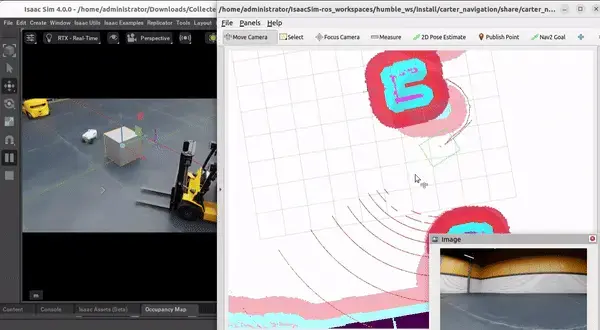
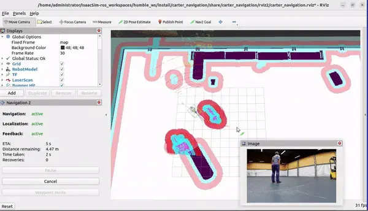
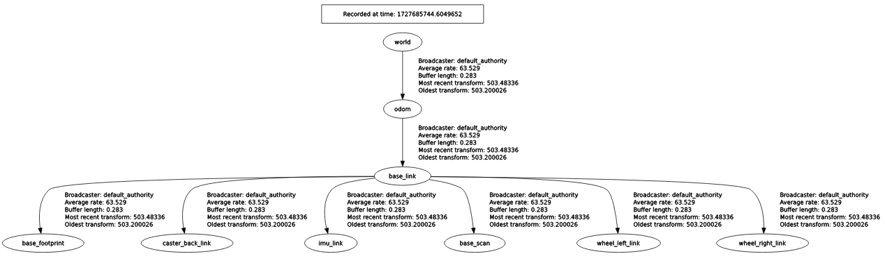

Real-World Test: Navigation in a Warehouse Environment
======================================================

.. image:: https://media.githubusercontent.com/media/NVIDIA-ISAAC-ROS/.github/main/resources/isaac_ros_docs/robots/nova_carter/nova_carter_diagram_front_left.png
   :alt: NOVA CARTER ROBOT
   :align: center

`Figure 1: NOVA Carter Robot navigating a warehouse environment. <https://media.githubusercontent.com/media/NVIDIA-ISAAC-ROS/.github/main/resources/isaac_ros_docs/robots/nova_carter/nova_carter_diagram_front_left.png>`_

In our observations, we tested the **Nova Carter robot**, as shown in the image above, for navigation in a small warehouse environment using Isaac Sim. The robot, equipped with 2D and 3D LiDAR, fisheye, and depth cameras, was tasked to navigate static and dynamic obstacles.

**Static Obstacle Navigation**
~~~~~~~~~~~~~~~~~~~~~~~~~~~~~~
The image below depicts Isaac Sim and RViz2 side-by-side, with the robot planning a path around a static object in the warehouse. While the high-definition scene enhances realism, the robot experiences noticeable lag due to the computational demand of the graphics.

                                    
   *Static obstacle navigation in Isaac Sim* 

**Dynamic Obstacle Detection**
~~~~~~~~~~~~~~~~~~~~~~~~~~~~~~
For dynamic obstacles, such as a person walking through the environment, the simulation struggled to update the map in real-time. By the time the person was detected and the map updated in RViz2, the person had already moved forward, leaving outdated occupancy marks. This delay compromises the reliability of real-time obstacle detection, an issue tied to the simulation and less likely to occur in real-world scenarios.

                                    
   *Dynamic obstacle detection in Isaac Sim* 

Tradeoff: Graphics vs. Speed
----------------------------

Isaac Sim’s high graphics quality comes at the cost of simulation speed. This tradeoff poses challenges when trying to create a digital twin of a realistic environment for algorithm testing. A digital twin must ensure safety protocols and accurate real-time processing. When the simulation platform itself becomes a bottleneck, it may be prudent to switch to alternatives like **Gazebo**, which can provide simpler scenes but better support for real-time algorithm testing without compromising safety.

---

Challenges with Isaac Sim for Custom Robots
-------------------------------------------

Another critical challenge is adapting Isaac Sim nodes for custom robots and environments. For instance:
Configuring TF for custom robots often leads to issues with Isaac Sim’s built-in nodes failing to recognize parent-child relationships, causing delinked transforms.

Isaac Sim provides several ROS2 nodes for handling TF transforms and odometry, such as:

- **TF Publisher** for sensors and full articulation trees.
- **Raw TF Publisher** for individual transforms.
- **Odometry Publisher** for robot movement tracking.

These nodes can be visualized in the Isaac Sim viewport for better debugging. However, the overhead in adapting and troubleshooting these nodes can be time-consuming.

.. image:: https://docs.omniverse.nvidia.com/isaacsim/latest/_images/isaac_tutorial_ros2_odometry_graph_final.png
   :alt: Isaac Sim nodes for ROS2.

Recommendations
---------------

While Isaac Sim is an excellent platform for high-fidelity simulations, it is not always ideal for scenarios requiring speed and efficiency. For testing safety protocols or creating realistic digital twins, alternatives like Gazebo might offer a more balanced solution. High-definition graphics are secondary to the ability to reliably test algorithms under realistic constraints.

