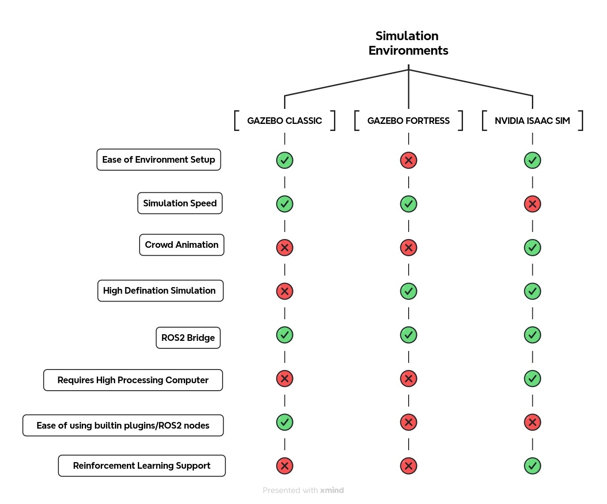

Comparison of Simulation Environments
=====================================

Testing autonomous robots in simulation environments is essential to evaluate their performance under both expected and unexpected conditions. This raises an important question: **Which simulation environment is best for testing diverse scenarios?**

To answer this, let’s compare three prominent simulation platforms: **Gazebo Classic**, **Gazebo Fortress**, and **NVIDIA Isaac Sim** (developed by Omniverse). Each platform has unique strengths and limitations, as highlighted in the **comparison chart above**.

- **Gazebo Classic** offers ease of environment setup and a fast simulation speed but lacks support for high-definition simulations and crowd animation. It is a reliable choice for basic ROS2 integration without requiring high-end hardware.
- **Gazebo Fortress** improves on crowd animation and introduces high-definition simulation capabilities. However, it is more resource-intensive and less user-friendly in terms of built-in plugins.
- **NVIDIA Isaac Sim** stands out for its high-fidelity simulation and reinforcement learning support, making it ideal for advanced robotics applications. However, it demands high processing power and has a steeper learning curve for ROS2 integration.

As illustrated in the **image above**, Gazebo Classic excels in simplicity, while NVIDIA Isaac Sim leads in advanced simulation capabilities. Choosing the right platform depends on your project's specific requirements, such as simulation fidelity or hardware limitations.

Observations on NVIDIA Isaac Sim for Simulation
-----------------------------------------------

NVIDIA Isaac Sim is a cutting-edge simulation platform that serves dual purposes:
simulation testing and reinforcement learning. In Omni Isaac Gym, robots can be
trained effectively for complex tasks. However, while Isaac Sim offers many
advantages, as highlighted in the comparison table, it may not always be the best
solution for simulations as a test bench.

Pros of Isaac Sim
^^^^^^^^^^^^^^^^^

- High-definition, realistic 3D scenes for immersive simulations.
- Integration with reinforcement learning frameworks for advanced robotic training.
- Built-in examples like Nova Carter robot navigation in warehouse environments.

Cons of Isaac Sim
^^^^^^^^^^^^^^^^^

- Requires high processing power, leading to potential lag in real-time applications.
- Challenges in adapting custom robots and environments, especially with configuring TF
  for parent-child relations.
- Slower map updates in RViz2, making real-time obstacle detection less reliable.

