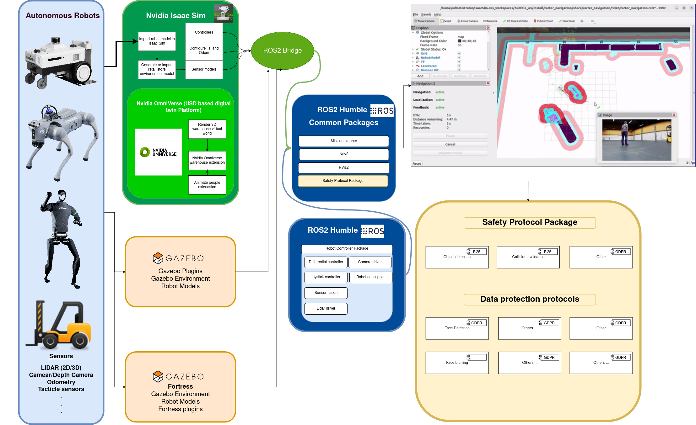
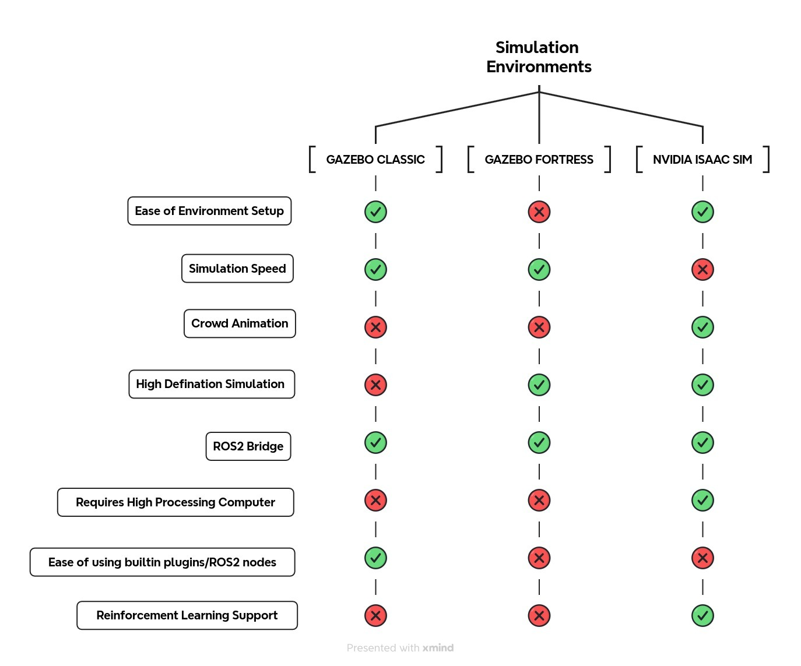
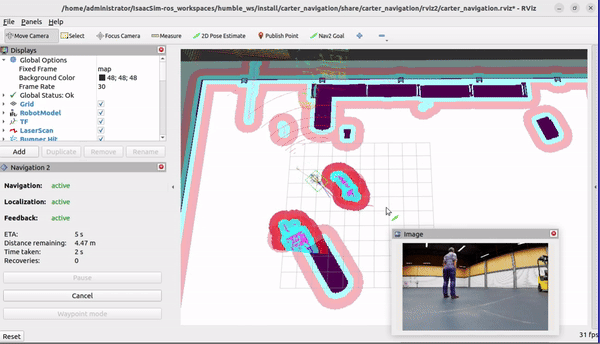
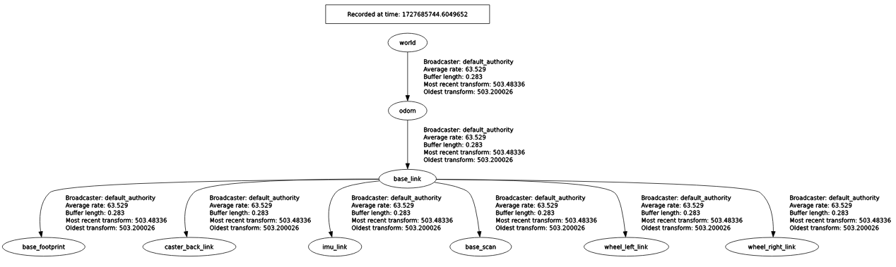
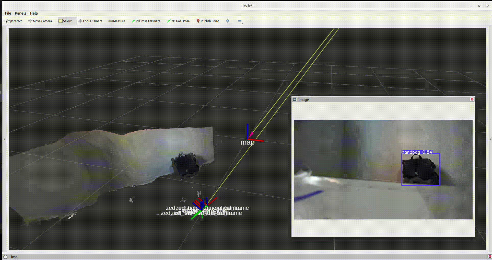

# Digital Twin-Driven Safety Protocol Development for HRI in German Retail Stores

Autonomous mobile robots are becoming increasingly intelligent through the integration of Artificial Intelligence (AI). These robots are now capable of making real-time decisions, such as determining optimal paths, navigating around obstacles, and dynamically choosing new routes. With advanced sensors like LiDAR and cameras, robots can detect and respond to both stationary and moving objects, ensuring the safety of people, themselves, and the surrounding environment.

However, to operate safely and effectively, robots must adhere to strict safety protocols and comply with data protection regulations when interacting with humans. This is crucial to minimize risks, especially when deploying autonomous robots in settings such as retail stores or warehouses. Without thorough testing, there is a risk of accidents, injuries, or inventory damage. As a result, authorities have established safety regulations to ensure that robots are designed with compliance in mind.

To address these challenges, MYBOTSHOP is investing significant time and resources into training students to test and validate safety protocols and data protection policies for both new and existing robots within simulation environments. These simulated tests ensure that robots can be safely deployed in real-world scenarios without jeopardizing human lives or privacy.

## Comparision of Simulation Environments

Testing autonomous robots in simulation environments is essential to evaluate their performance under both expected and unexpected conditions. This raises an important question: **Which simulation environment is best for testing diverse scenarios?**

To answer this, let’s compare three prominent simulation platforms: **Gazebo Classic**, **Gazebo Fortress**, and **NVIDIA Isaac Sim** (developed by Omniverse). Each platform has unique strengths and limitations, as highlighted in the **comparison chart above**.

- **Gazebo Classic** offers ease of environment setup and a fast simulation speed but lacks support for high-definition simulations and crowd animation. It is a reliable choice for basic ROS2 integration without requiring high-end hardware.
- **Gazebo Fortress** improves on crowd animation and introduces high-definition simulation capabilities. However, it is more resource-intensive and less user-friendly in terms of built-in plugins.
- **NVIDIA Isaac Sim** stands out for its high-fidelity simulation and reinforcement learning support, making it ideal for advanced robotics applications. However, it demands high processing power and has a steeper learning curve for ROS2 integration.

As illustrated in the **image above**, Gazebo Classic excels in simplicity, while NVIDIA Isaac Sim leads in advanced simulation capabilities. Choosing the right platform depends on your project's specific requirements, such as simulation fidelity or hardware limitations.

### Observations on NVIDIA Isaac Sim for Simulation

NVIDIA Isaac Sim is a cutting-edge simulation platform that serves dual purposes: simulation testing and reinforcement learning. In Omni Isaac Gym, robots can be trained effectively for complex tasks. However, while Isaac Sim offers many advantages, as highlighted in the comparison table, it may not always be the best solution for simulations as a test bench.

#### Pros of Isaac Sim:
- High-definition, realistic 3D scenes for immersive simulations.
- Integration with reinforcement learning frameworks for advanced robotic training.
- Built-in examples like Nova Carter robot navigation in warehouse environments.

#### Cons of Isaac Sim:
- Requires high processing power, leading to potential lag in real-time applications.
- Challenges in adapting custom robots and environments, especially with configuring TF for parent-child relations.
- Slower map updates in RViz2, making real-time obstacle detection less reliable.

---

### Real-World Test: Navigation in a Warehouse Environment

*[Figure 1: NOVA Carter Robot navigating a warehouse environment.][1]*

[1]: https://media.githubusercontent.com/media/NVIDIA-ISAAC-ROS/.github/main/resources/isaac_ros_docs/robots/nova_carter/nova_carter_diagram_front_left.png/ "Image source: Website Name"

In our observations, we tested the **Nova Carter robot** as show in the image above, for navigation in a small warehouse environment using Isaac Sim. The robot, equipped with 2D and 3D LiDAR, fisheye, and depth cameras, was tasked to navigate static and dynamic obstacles.

- **Static Obstacle Navigation** (Scene 1):  
  The image below depicts Isaac Sim and RViz2 side-by-side, with the robot planning a path around a static object in the warehouse. While the high-definition scene enhances realism, the robot experiences noticeable lag due to the computational demand of the graphics.

  

- **Dynamic Obstacle Detection** (Scene 2):  
  For dynamic obstacles, such as a person walking through the environment, the simulation struggled to update the map in real-time. By the time the person was detected and the map updated in RViz2, the person had already moved forward, leaving outdated occupancy marks. This delay compromises the reliability of real-time obstacle detection, an issue tied to the simulation and less likely to occur in real-world scenarios.

  
---

### Tradeoff: Graphics vs. Speed

Isaac Sim’s high graphics quality comes at the cost of simulation speed as show is the image above. This tradeoff poses challenges when trying to create a digital twin of a realistic environment for algorithm testing. A digital twin must ensure safety protocols and accurate real-time processing. When the simulation platform itself becomes a bottleneck, it may be prudent to switch to alternatives like **Gazebo**, which can provide simpler scenes but better support for real-time algorithm testing without compromising safety.

---

### Challenges with Isaac Sim for Custom Robots

Another critical challenge is adapting Isaac Sim nodes for custom robots and environments. For instance:
Configuring TF for custom robots often leads to issues with Isaac Sim’s built-in nodes failing to recognize parent-child relationships, causing delinked transforms. For example the image below shows proper links with parent and child frames.

Isaac Sim provides several ROS2 nodes for handling TF transforms and odometry, such as:
- **TF Publisher** for sensors and full articulation trees.
- **Raw TF Publisher** for individual transforms.
- **Odometry Publisher** for robot movement tracking.

These nodes can be visualized in the Isaac Sim viewport for better debugging. However, the overhead in adapting and troubleshooting these nodes can be time-consuming.

### Recommendations

While Isaac Sim is an excellent platform for high-fidelity simulations, it is not always ideal for scenarios requiring speed and efficiency. For testing safety protocols or creating realistic digital twins, alternatives like Gazebo might offer a more balanced solution. High-definition graphics are secondary to the ability to reliably test algorithms under realistic constraints.

### Why Gazebo Classic Can Do the Job Too

Gazebo Classic is a straightforward and reliable simulation platform for robotics. Unlike NVIDIA Isaac Sim, which demands high processing power, Gazebo Classic balances speed, graphics, and computation power, making it a practical choice for many use cases.

#### Features of Gazebo Classic:
- **Ease of Sensor Integration:**  
  Gazebo plugins for both exteroceptive and proprioceptive sensors can be directly added to the robot description. Once configured, the robot can be spawned in a launch file with minimal setup.

- **Customizable Environments:**  
  Gazebo Classic allows custom environments to be designed with ease. Built-in primitives like walls, doors, and other elements can be directly picked and placed within the simulation interface. This feature enables users to create detailed environments even before generating a map.

- **Example: Custom Robot in a Custom Environment**  
  Take a look at the **custom robot in a custom Gazebo Classic environment**.

  

  In this example, the robot operates within a slightly modified environment, featuring walls surrounding the right side of the compound. Such modifications are effortless thanks to the built-in graphical interface.

#### Advantages of Gazebo Classic:
- **Speed:**  
  Gazebo Classic is faster than Isaac Sim because it does not require high-definition simulations. While it is slightly slower than Gazebo Fortress during initial loading, it operates seamlessly once loaded.

- **User-Friendly Interface:**  
  Gazebo Classic’s built-in graphical interface simplifies the process of designing and testing environments for both indoor and outdoor scenarios.

- **Community Support:**  
  As a legacy platform, Gazebo Classic boasts extensive online support and documentation, unlike the relatively newer Gazebo Fortress.

#### A Drawback: Lack of Realistic Crowd Animation
While Isaac Sim offers realistic crowd animation to test moving humans in a simulated environment, Gazebo Classic does not have this feature. However, Gazebo Classic compensates for this limitation by allowing objects to be dropped in the middle of navigation to test **dynamic obstacle detection**. This functionality ensures that algorithms can still be validated for real-world scenarios involving unexpected obstacles.

#### Use Cases for Gazebo Classic:
Gazebo Classic is an excellent choice for testing algorithms, designing robots, and simulating indoor and outdoor environments. Its combination of moderate computational requirements, reasonable graphics, and faster performance makes it a practical option for those who prioritize functionality over high-definition realism.

----

### Gazebo Fortress: The Bridge Between Classic and Modern Simulation

Gazebo Fortress, the successor to Gazebo Classic, brings modern features and improved performance while maintaining the familiar usability of its predecessor. It offers enhanced simulation capabilities, making it a strong contender for robotics testing. However, it also introduces some complexities compared to Gazebo Classic, especially for those migrating existing ROS2 packages.

#### Key Features of Gazebo Fortress:
- **Improved Graphics and High-Definition Simulation:**  
  Gazebo Fortress enhances the graphical fidelity over Classic, offering more immersive environments. While not as graphically detailed as Isaac Sim, Fortress strikes a balance between realism and performance.
- **Better Support for Dynamic Environments:**  
  Fortress introduces features like improved collision detection and smoother handling of dynamic objects, which are critical for testing algorithms involving moving obstacles.
- **Enhanced Plugin Ecosystem:**  
  A rich plugin ecosystem allows for better integration of sensors and actuators, providing more flexibility for robot developers.
- **Support for ROS 2 Packages:**  
  Migrating ROS 2 packages from Gazebo Classic to Fortress is relatively straightforward, thanks to the [migration guide](https://gazebosim.org/docs/fortress/migrating_gazebo_classic_ros2_packages/). However, some adaptation may be needed, especially for custom robots or environments.

#### Example: A Custom Four-Wheel Robot in Gazebo Fortress
Take a look at the **GIF below**, showcasing **a custom four-wheel robot designed in Gazebo Fortress**. The robot demonstrates how Fortress’s enhanced features allow for more detailed and accurate simulations of navigation and other robotic functions.

#### Observations on Gazebo Fortress Environment
The **Gazebo Fortress environment** supports advanced features such as better collision detection and handling of dynamic obstacles. This makes it a suitable choice for testing algorithms in environments requiring higher fidelity than Gazebo Classic while maintaining a manageable computational load compared to Isaac Sim.

#### Observations and Trade-Offs:
- **Performance vs. Graphics:**  
  While Gazebo Fortress improves graphical fidelity, it requires more processing power than Classic, though significantly less than Isaac Sim. This makes it a middle ground between the two platforms.

- **Dynamic Obstacle Handling:**  
  Fortress performs better than Classic in handling dynamic objects, making it suitable for navigation scenarios involving moving humans or obstacles. However, Isaac Sim still leads in dynamic crowd animation.

- **Learning Curve:**  
  For those already familiar with Gazebo Classic, transitioning to Fortress is manageable with the help of the [migration guide](https://gazebosim.org/docs/fortress/migrating_gazebo_classic_ros2_packages/). On the other hand, Isaac Sim’s steep learning curve might pose a challenge for newcomers.

#### Recommendation:
Gazebo Fortress is ideal for those seeking a balance between performance, graphics, and usability. It is particularly well-suited for developers migrating from Gazebo Classic or those looking for advanced features without the heavy computational requirements of Isaac Sim.

---

### Incorporating Safety Protocols into Digital Twin Environments

To ensure robust and safe human-robot interactions (HRI) in dynamic retail environments, several safety protocols have been identified and integrated into digital twin simulations. These protocols are designed to address potential hazards, ensure compliance with regulatory standards, and improve the reliability of robots operating in close proximity to humans. Below are key safety protocols and their relevance to retail robotics:

### ISO 13482 – The New Safety Standard for Personal Care Robots

**Introduction**  
ISO 13482 is a groundbreaking safety standard tailored for personal care robots operating in close interaction with humans in non-industrial settings. These robots assist humans in tasks such as mobility and support, where safe physical interaction is critical. By emphasizing collision avoidance, force limits, and autonomous decision-making safety mechanisms, ISO 13482 establishes a comprehensive framework for ensuring safety.

As my work focuses on developing digital twin-driven safety protocols for human-robot interaction (HRI) in retail environments using NVIDIA Isaac Sim, incorporating ISO 13482 ensures virtual and real-world robots adhere to internationally recognized safety standards.

---

#### **The Need for Incorporating ISO 13482 in Retail Robotics**
Retail robotics introduces unique challenges due to frequent human presence in dynamic environments. ISO 13482 provides the following key benefits for ensuring safety in retail spaces:
1. **Close Proximity Operations:**  
   Robots often share spaces with people, requiring protocols to mitigate risks such as collisions or incorrect autonomous decisions.
2. **Human-Centric Risk Mitigation:**  
   The standard offers structured approaches to reducing hazards like physical contact, object mismanagement, and navigation errors.
3. **Compliance with Legal Standards:**  
   Adherence to ISO 13482 ensures that robots meet safety regulations essential for commercial deployment in retail settings.

---

#### **Application in a Digital Twin Simulation Environment**
Incorporating ISO 13482 into a digital twin environment using NVIDIA Isaac Sim enables thorough testing of safety protocols in a risk-free, controlled setting. The digital twin approach provides:
1. **Simulating Hazard Scenarios:**  
   Guidelines for identifying hazards like collisions or loss of stability can be simulated to refine safety protocols.
2. **Testing Safety Measures Virtually:**  
   Force and speed limits, collision avoidance, and emergency stops can be validated before physical deployment.
3. **Validating Autonomous Decisions:**  
   Robots' decision-making algorithms are tested for robustness, ensuring safe navigation in complex retail scenarios.

---

#### **Novelty: Extending ISO 13482 into Digital Twins**
One of the novel contributions of my work is applying ISO 13482 in digital twin simulations, traditionally limited to physical testing. This approach offers:
- **Cost and Risk Reduction:**  
  Virtual simulations minimize the need for expensive and risky physical tests.
- **Pre-validation of Protocols:**  
  Ensuring compliance with ISO 13482 in a simulation reduces real-world safety failures.
- **HRI Research Advancement:**  
  Demonstrating the effectiveness of simulation-driven safety standards opens new avenues for innovation in human-robot interaction.

---

#### **Relevance to Human-Robot Interaction in Retail**
ISO 13482 plays a crucial role in retail robotics by prioritizing human safety in dynamic environments. Key applications include:
1. **Collision Avoidance:**  
   Algorithms ensure safe navigation through crowded spaces by preventing unintended collisions.
2. **Privacy and Data Security:**  
   Integrating person detection and anonymization protocols aligns with physical safety and privacy requirements.

---

#### **Future Research and Extensions**
Although ISO 13482 is not widely tested in digital twin environments, my work lays the groundwork for its broader application. Future opportunities include:
- Developing universal guidelines for testing robots in digital twin environments.
- Collaborating with standardization bodies to formally integrate simulation-driven safety protocols.

---

**Conclusion**  
Incorporating ISO 13482 into digital twin simulations bridges the gap between virtual and real-world safety. By leveraging NVIDIA Isaac Sim, my work pre-validates safety protocols for retail robots, ensuring they can safely interact with humans. This innovative approach not only enhances safety in human-robot interaction but also pushes the boundaries of simulation technology and robotics.

---

### IEEE P7009 – Fail-Safe Design Standard for Autonomous Systems

**Introduction**  
The **IEEE P7009** standard provides a framework for developing fail-safe mechanisms in autonomous and semi-autonomous systems. It focuses on transitioning systems to safe states during failures, ensuring safety without requiring human intervention. By incorporating fail-safe designs that autonomously detect and respond to failures, the standard minimizes potential harm and ensures predictable system behavior.

In this work, IEEE P7009 is integrated into a digital twin-driven approach using **NVIDIA Isaac Sim** to pre-validate fail-safe mechanisms for human-robot interaction (HRI) in retail environments. This allows for structured, risk-free testing of safety protocols in dynamic retail scenarios.

---

#### **The Need for IEEE P7009 in Retail Robotics**
Retail robotics introduces unique challenges due to high human traffic and unpredictable environments. Incorporating IEEE P7009 ensures robots can respond to unexpected events such as sensor malfunctions, navigation errors, or collisions by transitioning to safe states. The standard’s key contributions to retail robotics include:
1. **Autonomous Detection of Failures:**  
   Robots must detect and respond to failures without human intervention, ensuring continuous safety.
2. **Transition to Safe State:**  
   Robots can autonomously stop, reroute, or move to designated safe zones during failures, minimizing risks.
3. **Structured Risk Mitigation:**  
   IEEE P7009 provides guidelines to design and validate fail-safe mechanisms, reducing risks through systematic testing.

---

#### **Application in a Digital Twin Simulation Environment**
Integrating IEEE P7009 into a digital twin environment using NVIDIA Isaac Sim allows comprehensive testing of fail-safe mechanisms under controlled conditions. This approach enables:
1. **Simulating Failure Scenarios:**  
   Simulate events such as sensor malfunctions, navigation errors, or sudden obstacles to assess the robot's response according to IEEE P7009.
2. **Testing Autonomous Fail-Safe Responses:**  
   Evaluate responses like emergency stops, rerouting, or moving to safe zones in simulated environments.
3. **Assessing Safety Protocol Effectiveness:**  
   Refine fail-safe protocols by measuring their effectiveness in simulation before physical deployment.

---

#### **Novelty: Integrating IEEE P7009 with Digital Twin Technology**
The application of IEEE P7009 within digital twin simulations represents a novel contribution. Traditionally limited to physical testing, pre-validation of fail-safe protocols in virtual environments offers:
- **Pre-validation in Virtual Environments:**  
  Risk-free testing of fail-safe protocols in a simulated environment allows iterative improvements.
- **Cost and Time Efficiency:**  
  Reduce the need for expensive and time-intensive physical testing by fine-tuning protocols in simulation.
- **Enhanced Safety for HRI:**  
  Simulating complex HRI scenarios enhances the robustness of fail-safe mechanisms in dynamic retail settings.

---

#### **Relevance to Human-Robot Interaction in Retail**
Fail-safe mechanisms are crucial in retail environments, ensuring robots can navigate safely and respond effectively to failures. IEEE P7009 directly supports these goals:
1. **Immediate Stop and Safe Zone Transition:**  
   Robots can immediately stop or move to designated safe zones upon failure detection, preventing collisions and maintaining safety.
2. **Autonomous Recovery Protocols:**  
   Enables robots to detect and autonomously recover from failures, minimizing human intervention and enhancing operational efficiency.

---

#### **Future Research and Potential Extensions**
While IEEE P7009 has been applied in other domains, its integration into digital twin environments is still evolving. Future research opportunities include:
- Developing specific guidelines for testing fail-safe mechanisms in digital twin simulations.
- Collaborating with standardization bodies to incorporate simulation-based testing into the IEEE P7000 series.

---

**Conclusion**  
Integrating IEEE P7009 into digital twin simulations provides a structured and effective way to ensure fail-safe human-robot interaction in retail environments. Using NVIDIA Isaac Sim, this work demonstrates how fail-safe protocols can be virtually tested and validated, paving the way for safer real-world implementations. By extending IEEE P7009 into digital twin environments, this approach advances the fail-safe framework and the use of simulation in robotics development.

---

Here is the summary of all the safety protocols that are relevant for the retail store settings. The summary of future work and or gaps have also been identified and summarized in the table below:

### Safety Protocols, Their Relevance, and Future Work/Gaps

| **Protocol Name**   | **Summary**                                                                                       | **Relevance**                                                                                                   | **Future Work/Gaps**                                                                                       |
|----------------------|---------------------------------------------------------------------------------------------------|----------------------------------------------------------------------------------------------------------------|-----------------------------------------------------------------------------------------------------------|
| **ISO 13482**       | Safety standard for personal care robots, ensuring safe physical interaction between robots and humans, focusing on risk reduction and hazard management. | Ensures safe human-robot interaction in retail by providing guidelines on collision avoidance, force limits, and risk mitigation. | Has not been extensively tested in digital twin environments; future work could involve virtual validation before physical deployment. |
| **IEEE P7009**      | Provides a framework for developing fail-safe mechanisms in autonomous systems, ensuring systems transition to safe states in case of failures. | Ensures robots in retail environments can prevent harm by transitioning to safe states during failures, aligning with fail-safe human-robot interaction protocols. | Future work should focus on integrating fail-safe mechanisms with digital twin simulations for better pre-validation of safety protocols in dynamic retail environments. |
| **IEEE 7001-2021**  | Provides measurable, testable levels of transparency for autonomous systems, ensuring that their decision-making processes are discoverable and understandable. | Ensures that retail robots interacting with humans operate transparently, making it possible to understand why and how the system made specific decisions. | Ethical work should explore integrating transparency measures into digital twin simulations to validate the robot’s behavior before real-world deployment. |
| **IEEE 1228**       | Provides guidelines for developing safety plans for software systems, addressing potential software failures in safety-critical applications. | Relevant for designing safety plans for robot control software, ensuring software failures are anticipated and mitigated in human-robot interaction scenarios. | Needs greater attention to unplanned software updates and their impact on safety in retail. |
| **ISO/TS 15066**    | Safety standards for collaborative robots (cobots), focusing on limits for force and speed to ensure safe human-robot interaction. | Guides safety protocols for collaborative robots in retail, where safe interactions with force and speed limits are required. | Future work involves refining force thresholds based on real-world interaction feedback in retail scenarios. |
| **ISO 12100**       | Defines principles for risk assessment and reduction in machinery, providing guidelines to identify hazards and implement protective measures. | Provides a framework for risk assessment and mitigation in digital twin simulations, assisting in the development of safety protocols for retail robot behavior. | Need to validate assessment models through iterative tests in digital twin and real-world conditions. |

---

### Data Protection Policies: Ensuring Privacy in Retail Robot Operations

After discussing and identifying some of the key safety protocols—an integral part of any retail store environment—we now focus on **data protection policies**. Privacy is a critical concern, as most people would want their personal information, including facial data, to remain secure. At the same time, detection using cameras is an essential aspect of ensuring the safety and protection of people around robots.

To address this challenge, a solution must allow robots to detect individuals in a retail store environment **without compromising their privacy**. For example, a robot could detect a person’s presence, blur their face region, and display this blurred face on the robot's interface. This ensures the person's identity is protected while the robot continues to navigate safely, avoiding possible collisions.

Below are some of the **data protection policies** identified for this study:

| **Protocol Name** | **Summary**                                                                                                  | **Relevance**                                                                                                      | **Future Work/Gaps**                                                                                      |
|-------------------|--------------------------------------------------------------------------------------------------------------|-------------------------------------------------------------------------------------------------------------------|-----------------------------------------------------------------------------------------------------------|
| **IEEE 7000**     | Ethical guidelines for system design, focusing on privacy, transparency, and data protection in systems interacting with humans.                  | Guides ethical implementation of robotics, ensuring privacy, transparency, and data management where robots interact with people, especially in retail. | Ethical principles need wider adoption in robotic design, especially in automated decision-making and transparency in human-robot interactions. |
| **GDPR**          | Regulates data protection and privacy in the EU, providing guidelines for lawful data processing, ensuring consent, transparency, and the right to erasure. | Ensures personal data collected during person detection in retail is handled securely and compliant with privacy regulations. | Further refinement is needed in automated anonymization, real-time monitoring, and adapting to evolving privacy and security requirements. |

---

### Leveraging Ultralytics YOLO11 for Privacy Protection

During the exploration of data protection policies, I utilized the latest release from Ultralytics: **YOLOv11**. Compared to YOLOv8, YOLOv11 is significantly faster and more accurate, making it an excellent choice for implementing privacy features like object blurring. 

#### Benefits of Using YOLOv11 for Object Blurring:
1. **Privacy Protection:** Effectively obscures sensitive or identifiable information, ensuring compliance with data protection policies like GDPR.
2. **Selective Focus:** Targets specific objects (e.g., faces) for blurring, while maintaining essential visual content for navigation and safety.
3. **Real-Time Processing:** Executes object blurring efficiently in dynamic environments, making it suitable for instant privacy enhancements.

Using YOLOv11, I trained and deployed a model on the **Go2 robot**. As shown in the **GIF below**, the robot can detect a person’s face, blur the region effectively, and display this blurred view on its screen. This functionality works as long as the person remains within the robot camera’s frame.

### YOLOv11 Performance Comparison

The chart below illustrates how YOLOv11 outperforms earlier models like YOLOv8 in terms of speed and accuracy. YOLOv11 introduces significant improvements, making it the preferred choice for real-time applications such as privacy-focused object detection and blurring.

*Source: [Image Reference](https://raw.githubusercontent.com/ultralytics/assets/refs/heads/main/yolo/performance-comparison.png)*

**Key Observations:**
- **Speed:** YOLOv11 processes frames faster than YOLOv8, making it ideal for dynamic environments like retail stores where robots must respond quickly.  
- **Accuracy:** YOLOv11 demonstrates higher detection accuracy compared to YOLOv8, ensuring reliable identification and processing of objects and faces.  
- **Efficiency in Privacy Tasks:** With improved performance metrics, YOLOv11 ensures privacy protection features, such as object blurring, are executed without compromising system speed or functionality.

Using YOLOv11, I trained and deployed a model on the **Go2 robot**. As shown in the **GIF below**, the robot effectively detects a person’s face, blurs the region, and displays this securely on its screen while ensuring smooth operation.  

---

### Generalization Across Cameras
An important note: while this application was tested with the Go2 robot, it is designed to work with other cameras as well, including the **ZED 2i**. This flexibility ensures the solution can be applied across different hardware configurations, enhancing its usability in diverse environments.

For more details about YOLOv11, refer to the [Ultralytics YOLO11 Documentation](https://docs.ultralytics.com/models/yolo11/).

---

### Exploring Object Detection with ZED 2i Camera

Before discussing use cases using Navigation2 in ROS2 Humble, I wanted to explore validation in a simulation environment by tackling a hands-on task. To do this, I worked with the industrial-level depth camera **ZED 2i** (refer to the image below).  

Depth cameras are a crucial component of any robot. Acting as the robot's eyes, they enable the robot to not only see objects but also infer their distance from the camera. Unlike standard fisheye cameras, depth cameras like the ZED 2i allow robots to estimate the 3D pose of objects relative to the camera, which is vital for tasks such as navigation and object interaction.

#### Why Depth Cameras Matter
In scenarios where a robot relies heavily on its depth camera:
- **Object Localization:** Depth cameras help estimate the location of objects in the environment while the robot is moving.  
- **Human-Robot Interaction:** They enable robots to classify objects and humans, improving situational awareness in dynamic environments like retail stores.  
- **Pose Estimation:** The 3D pose of objects can be calculated, helping robots identify the orientation and position of objects.  

As shown in the **GIF below**, the robot classified a handbag with approximately 84% accuracy, demonstrating the capability to detect and classify objects. This was achieved using a trained YOLOv8 model, with data preprocessing and augmentation performed using **RoboFlow**.

---

### Why I Chose YOLOv8
I selected the YOLOv8 model for this task because of its flexibility and support for multiple tasks such as detection, classification, and segmentation. Below is a comparison of its key features, which influenced my decision:

| **Feature**                 | **YOLOv8**          | **YOLOv5** | **YOLOv4** |
|-----------------------------|---------------------|------------|------------|
| **Architecture**            | Unified Detection, Segmentation, Classification | Separate models | Separate models |
| **Speed**                   | Faster than YOLOv5 | Moderate   | Slower     |
| **Accuracy**                | Improved           | High       | Moderate   |
| **Supported Modes**         | Detection, Classification, Segmentation | Detection, Classification | Detection only |
| **Ease of Use**             | Intuitive          | Intuitive  | Moderate   |

For more details, refer to the [YOLOv8 documentation](https://docs.ultralytics.com/models/yolov8/).

Additionally, the comparison image below illustrates YOLOv8’s performance metrics relative to previous versions, highlighting its superior speed and accuracy.  

  
*Source: [YOLOv8 Documentation](https://docs.ultralytics.com/models/yolov8/)*

These attributes make YOLOv8 a clear choice for real-time robotics applications where detection and classification tasks demand both accuracy and efficiency.

---

### Why I Chose ZED 2i
The **ZED 2i** camera was an ideal choice for this task due to its built-in **body tracking feature**. In dynamic environments like retail stores, where humans are continuously moving, it is critical to track human bodies effectively. The ZED 2i’s advanced capabilities, such as tracking 18 key points of the human body, enable precise and reliable tracking.

> Refer to the [ZED 2i Body Tracking Documentation](https://www.stereolabs.com/docs/body-tracking/) for more details.

Here’s a visual representation of the 18 key points tracked by the ZED 2i camera:  

Below is a **GIF of a scene showcasing keypoints being detected in real-time** using the ZED 2i camera:  

The GIF illustrates how the ZED 2i camera accurately tracks and detects human movements by identifying body keypoints, ensuring seamless performance in dynamic environments like retail stores.

Another compelling reason for experimenting with the ZED 2i camera is its **availability within Isaac Sim**. NVIDIA Isaac Sim supports the ZED 2i camera as a virtual sensor, allowing developers to test and validate robotics applications in high-fidelity simulated environments before deploying them in real-world scenarios.

*Image Source: [ZED2i Documentation](https://www.stereolabs.com/docs/isaac-sim)*

> For more information, visit the [Isaac Sim ZED 2i Documentation](https://www.stereolabs.com/docs/isaac-sim).

---

### Outcome and Applications
The combination of the ZED 2i camera and YOLOv8 allowed the robot to:
1. **Classify Objects with High Accuracy:** For example, identifying handbags, as shown in the GIF.  
2. **Track Human Movements:** The built-in body tracking feature ensured accurate tracking of humans, which is crucial in environments like retail stores.  
3. **Process Augmented Data:** Using RoboFlow for data preprocessing and augmentation streamlined the training process and improved detection accuracy.

These insights and tools lay a strong foundation for creating robust object detection systems, especially in settings where robots need to navigate and interact with complex environments efficiently.

---

